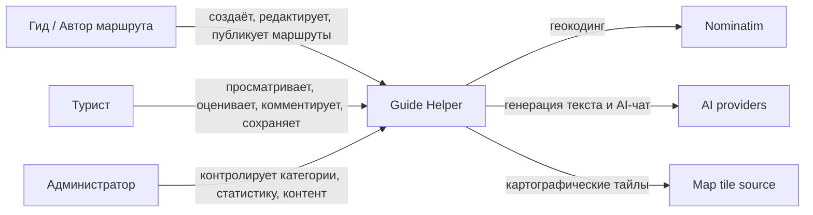
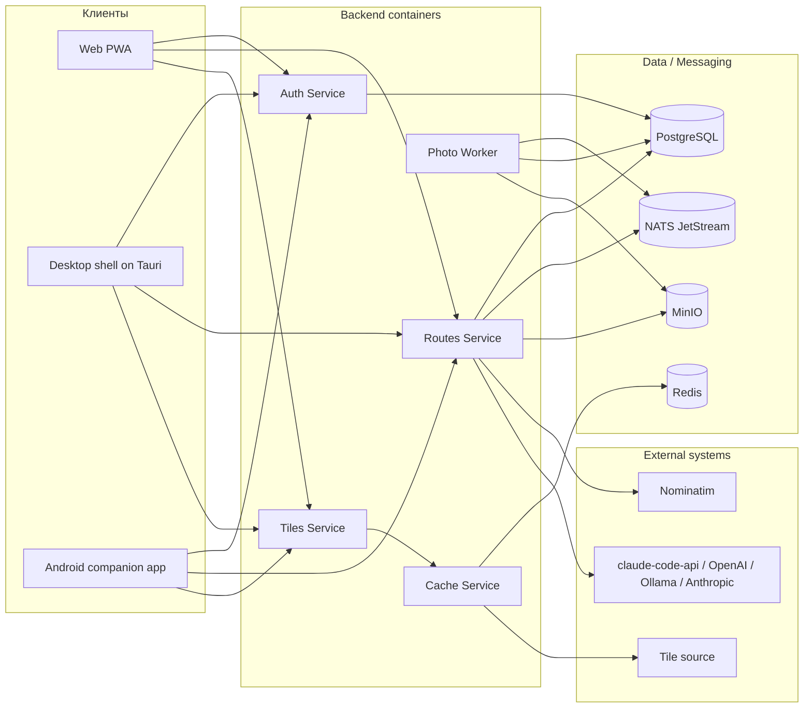
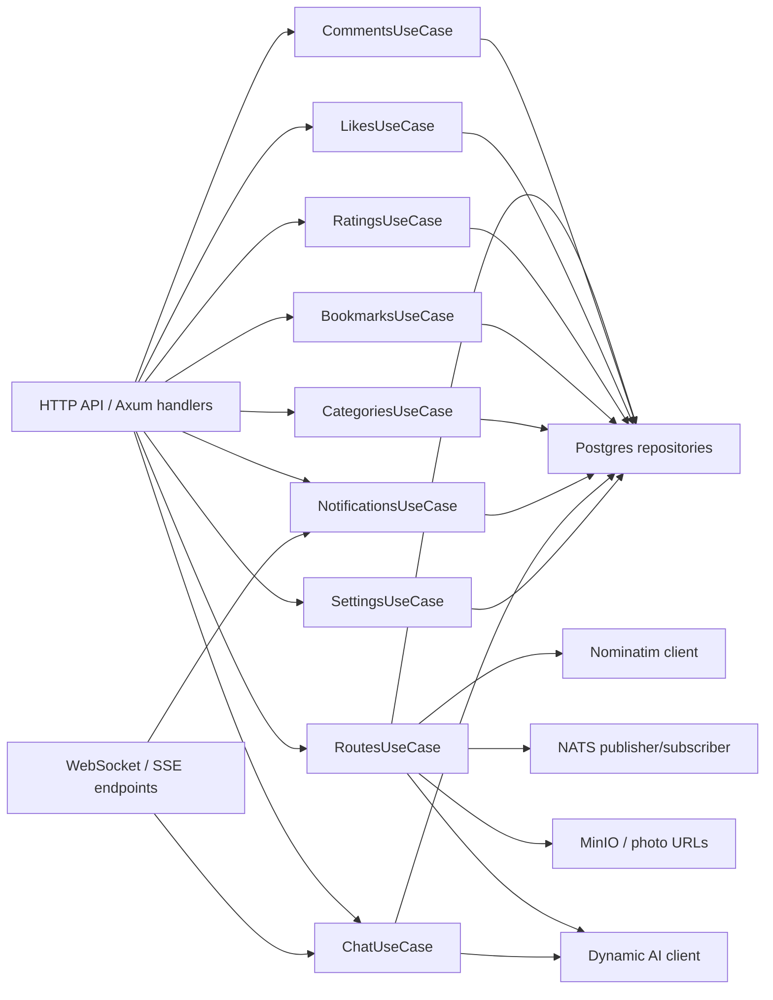
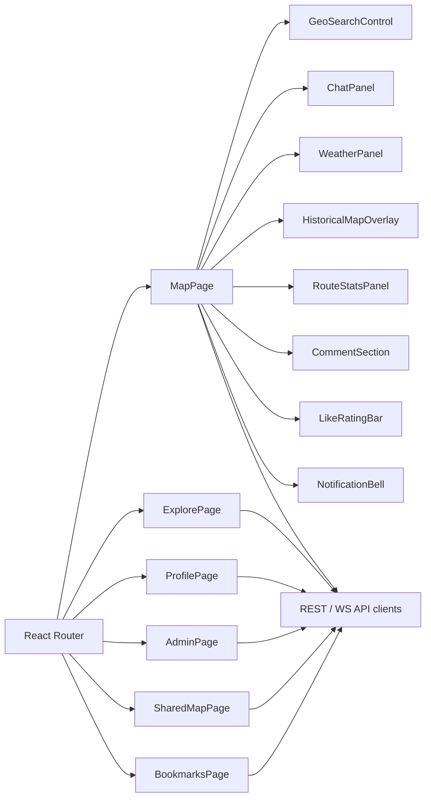

# C4-диаграммы системы Guide Helper

Дата: 21 апреля 2026  
Назначение: показать систему в формате C4 на уровнях Context, Container и Component.

## 1. Как использовать эти диаграммы на защите

Если надо объяснить проект быстро:
- сначала показывается `C1`, чтобы объяснить, кто взаимодействует с системой;
- потом `C2`, чтобы объяснить, из каких контейнеров состоит решение;
- потом `C3`, чтобы показать внутреннее устройство самого важного контейнера, то есть `Routes Service`.

## 2. C1. System Context

### Что говорить

Guide Helper находится между тремя основными ролями пользователя и тремя ключевыми внешними интеграциями:
- геокодинг;
- AI;
- картографические тайлы.

## 3. C2. Container Diagram

### Контейнеры и их роль

| Контейнер | Роль |
| --- | --- |
| Web PWA | основной пользовательский интерфейс |
| Desktop shell | desktop-вариант web-клиента |
| Android app | полевой сбор маршрута |
| Auth Service | аутентификация, роли, JWT |
| Routes Service | основной доменный сервис |
| Photo Worker | фоновая обработка фотографий |
| Tiles Service | выдача тайлов карт |
| Cache Service | кеш тайлов |
| PostgreSQL | основная БД |
| MinIO | объектное хранилище фото |
| NATS JetStream | событийная шина |
| Redis | быстрый кеш |

## 4. C3. Component Diagram для Routes Service

### Что важно объяснить

`Routes Service` это не просто CRUD маршрутов. Он содержит:
- доменную логику маршрутов и версий;
- social layer;
- AI-чат;
- геокодинг;
- связку с очередью обработки фотографий;
- уведомления;
- настройки сложности маршрута.

Поэтому именно этот контейнер и является сердцем системы.

## 5. C3. Component Diagram для Frontend

### Что говорить

Frontend это не одна карта, а целый набор специализированных страниц:
- редактор маршрута;
- каталог;
- профиль;
- закладки;
- админка;
- общий просмотр по ссылке.

## 6. C4-картина в одном абзаце

На уровне контекста Guide Helper взаимодействует с гидом, туристом и администратором, а также с геокодингом, AI и картографическими сервисами. На уровне контейнеров система состоит из web и mobile клиентов, набора backend-сервисов, очереди сообщений, БД и объектного хранилища. На уровне компонентов ядром решения является `Routes Service`, который объединяет маршруты, социальные функции, AI, уведомления и обработку событий.

## 7. Что можно отдельно дорисовать позже

Если понадобится усилить защиту ещё сильнее, можно добавить:
- sequence diagram “загрузка фото и его асинхронная обработка”;
- sequence diagram “запрос AI-чата с map context”;
- deployment diagram Kubernetes.
