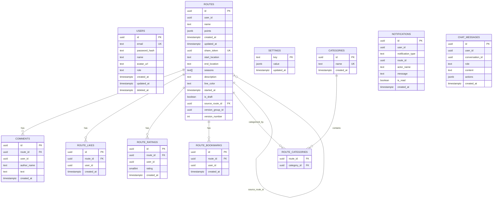

# Схема БД Guide Helper

Дата: 21 апреля 2026  
Источник: реальные SQL-миграции из `backend/auth/migrations` и `backend/routes/migrations`

## 1. Общая идея модели данных

В системе используется PostgreSQL. Логически данные разделены на два bounded context:

- `auth` контур: пользователи и роли;
- `routes` контур: маршруты, категории, комментарии, лайки, оценки, закладки, уведомления, чат и настройки.

Это важно для защиты: в таблицах `routes`-контура нет внешних ключей на `users`, потому что аутентификация вынесена в отдельный сервис. Вместо жёсткой межсервисной FK-связи в предметных таблицах хранится `user_id` как UUID.

## 2. Главные проектные решения

### Почему точки маршрута не отдельная таблица

Точки маршрута хранятся в поле `routes.points` типа `JSONB`, а не в нормализованной таблице `route_points`.

Причины:
- каждая точка содержит сложную вложенную структуру;
- состав полей точки менялся в ходе разработки;
- удобно хранить заметки, фото и UI-настройки точки в одном JSON-документе;
- версия маршрута копируется как единый объект;
- для текущего сценария системы важнее гибкость маршрута, чем аналитические SQL-запросы по каждой точке.

### Что лежит внутри `points`

Каждая точка может содержать:
- координаты;
- имя;
- заметку;
- фото и статус обработки;
- цвет и размер маркера;
- размер и форму превью;
- режим сегмента;
- длительность сегмента в минутах.

## 3. Логические таблицы

Всего в текущей модели `11` логических таблиц:

1. `users`
2. `routes`
3. `comments`
4. `route_likes`
5. `route_ratings`
6. `settings`
7. `categories`
8. `notifications`
9. `chat_messages`
10. `route_categories`
11. `route_bookmarks`

## 4. ER-диаграмма

Важно:
- `users` логически связана со многими таблицами через `user_id`, но физических FK на `users.id` нет;
- `notifications.route_id` тоже хранится без FK, хотя логически ссылается на маршрут.

## 5. Таблица `users`

Контур: `auth`

| Поле | Тип | Назначение |
| --- | --- | --- |
| `id` | UUID PK | идентификатор пользователя |
| `email` | TEXT UNIQUE | логин |
| `password_hash` | TEXT | Argon2-хеш пароля |
| `name` | TEXT | отображаемое имя |
| `avatar_url` | TEXT | аватар |
| `role` | TEXT | `user`, `moderator`, `admin` |
| `created_at` | TIMESTAMPTZ | дата создания |
| `updated_at` | TIMESTAMPTZ | дата обновления |
| `deleted_at` | TIMESTAMPTZ | soft-delete |

## 6. Таблица `routes`

Контур: `routes`

| Поле | Тип | Назначение |
| --- | --- | --- |
| `id` | UUID PK | идентификатор маршрута |
| `user_id` | UUID | автор маршрута |
| `name` | TEXT | название маршрута |
| `points` | JSONB | массив точек маршрута |
| `created_at` | TIMESTAMPTZ | дата создания |
| `updated_at` | TIMESTAMPTZ | дата обновления |
| `share_token` | UUID NULL | токен публичной ссылки |
| `start_location` | TEXT | стартовая локация |
| `end_location` | TEXT | конечная локация |
| `seasons` | TEXT[] | сезоны |
| `description` | TEXT | описание маршрута |
| `line_color` | TEXT | цвет линии |
| `started_at` | TIMESTAMPTZ NULL | дата и время старта |
| `is_draft` | BOOLEAN | признак черновика |
| `source_route_id` | UUID NULL | родительская версия |
| `version_group_id` | UUID | группа версий |
| `version_number` | INTEGER | номер версии |

### Индексы `routes`

| Индекс | Назначение |
| --- | --- |
| `idx_routes_user_id` | список маршрутов пользователя |
| `idx_routes_share_token` | быстрый поиск по публичному токену |
| `idx_routes_source_route_id` | дерево версий |
| `idx_routes_version_group_id` | история версий |
| `idx_routes_version_group_number` | уникальность номера версии внутри группы |

## 7. Таблица `comments`

| Поле | Тип | Назначение |
| --- | --- | --- |
| `id` | UUID PK | идентификатор комментария |
| `route_id` | UUID FK -> routes.id | маршрут |
| `user_id` | UUID | автор |
| `author_name` | TEXT | имя автора на момент публикации |
| `text` | TEXT | текст комментария |
| `created_at` | TIMESTAMPTZ | время создания |

Индексы:
- `idx_comments_route_id`
- `idx_comments_route_id_created_at`

## 8. Таблица `route_likes`

| Поле | Тип | Назначение |
| --- | --- | --- |
| `id` | UUID PK | идентификатор лайка |
| `route_id` | UUID FK -> routes.id | маршрут |
| `user_id` | UUID | кто поставил |
| `created_at` | TIMESTAMPTZ | время создания |

Индексы:
- уникальность `(route_id, user_id)`;
- индекс по `route_id`.

## 9. Таблица `route_ratings`

| Поле | Тип | Назначение |
| --- | --- | --- |
| `id` | UUID PK | идентификатор оценки |
| `route_id` | UUID FK -> routes.id | маршрут |
| `user_id` | UUID | кто оценил |
| `rating` | SMALLINT | значение от 1 до 5 |
| `created_at` | TIMESTAMPTZ | время создания |

Индексы:
- уникальность `(route_id, user_id)`;
- индекс по `route_id`.

## 10. Таблица `settings`

| Поле | Тип | Назначение |
| --- | --- | --- |
| `key` | TEXT PK | имя настройки |
| `value` | JSONB | значение настройки |
| `updated_at` | TIMESTAMPTZ | дата обновления |

Сейчас там используется, в частности, `difficulty_thresholds`.

## 11. Таблица `categories`

| Поле | Тип | Назначение |
| --- | --- | --- |
| `id` | UUID PK | идентификатор категории |
| `name` | TEXT UNIQUE | имя категории |
| `created_at` | TIMESTAMPTZ | дата создания |

Начальные категории:
- `hiking`
- `cycling`
- `historical`
- `nature`
- `urban`

## 12. Таблица `route_categories`

Таблица связи many-to-many между маршрутами и категориями.

| Поле | Тип | Назначение |
| --- | --- | --- |
| `route_id` | UUID FK -> routes.id | маршрут |
| `category_id` | UUID FK -> categories.id | категория |

PK:
- `(route_id, category_id)`

## 13. Таблица `notifications`

| Поле | Тип | Назначение |
| --- | --- | --- |
| `id` | UUID PK | идентификатор уведомления |
| `user_id` | UUID | получатель |
| `notification_type` | TEXT | тип уведомления |
| `route_id` | UUID | связанный маршрут |
| `actor_name` | TEXT | кто инициировал событие |
| `message` | TEXT | текст уведомления |
| `is_read` | BOOLEAN | прочитано или нет |
| `created_at` | TIMESTAMPTZ | время создания |

Индексы:
- `idx_notifications_user_unread`
- `idx_notifications_user_created`

## 14. Таблица `chat_messages`

| Поле | Тип | Назначение |
| --- | --- | --- |
| `id` | UUID PK | идентификатор сообщения |
| `user_id` | UUID | владелец диалога |
| `conversation_id` | UUID | идентификатор беседы |
| `role` | TEXT | `user` или `assistant` |
| `content` | TEXT | текст сообщения |
| `actions` | JSONB NULL | действия, которые AI предлагает UI |
| `created_at` | TIMESTAMPTZ | время создания |

Индексы:
- `idx_chat_messages_user_conv`
- `idx_chat_messages_user_created`

## 15. Таблица `route_bookmarks`

| Поле | Тип | Назначение |
| --- | --- | --- |
| `id` | UUID PK | идентификатор записи |
| `route_id` | UUID FK -> routes.id | маршрут |
| `user_id` | UUID | пользователь |
| `created_at` | TIMESTAMPTZ | время создания |

Индексы:
- уникальность `(route_id, user_id)`;
- `idx_route_bookmarks_user_id`.

## 16. Как эта схема работает на пользовательских сценариях

### Создание маршрута

Пишется запись в `routes`, а категории сохраняются в `route_categories`.

### Публикация маршрута

У маршрута появляется `share_token`, и он становится доступен по публичной ссылке.

### Комментарии, лайки, оценки

Используются отдельные таблицы `comments`, `route_likes`, `route_ratings`.

### Закладки

Используется `route_bookmarks`.

### Уведомления

События для пользователя пишутся в `notifications`.

### AI-чат

История диалога хранится в `chat_messages`.

### Версионирование

Используются поля:
- `is_draft`
- `source_route_id`
- `version_group_id`
- `version_number`

Это позволяет группировать версии маршрута и отслеживать их происхождение.

## 17. Что важно проговорить комиссии про БД

### Сильные аргументы

- модель данных не сводится к одному маршруту, а покрывает весь жизненный цикл маршрута;
- social и AI-функции тоже имеют свою устойчивую модель хранения;
- данные по маршруту и точкам адаптированы под продуктовую задачу, а не только под “академическую нормализацию”;
- хранение точек в `JSONB` осознанное, а не случайное;
- отсутствие FK к `users` это следствие микросервисного разделения, а не ошибка.

### Потенциальные вопросы

Почему не сделали `route_points` отдельной таблицей:
- потому что приоритет был на гибкость структуры точки и версионирование маршрута как целого.

Почему нет FK к `users`:
- потому что `auth` изолирован как отдельный сервис и не должен быть жёстко связан на уровне схемы БД с `routes`.

## 18. Что ещё можно добавить позже

Если будет нужно усилить диплом визуально, можно отдельно сделать:
- диаграмму последовательности “создание маршрута с фото”;
- диаграмму жизненного цикла версии маршрута;
- схему JSON-структуры `RoutePoint`.

