# E2E-аудит создания маршрута Guide Helper

Дата запуска: 05.05.2026, 18:18:15
Стенд: https://guidehelper.dubrovskih.ru
Тестовый пользователь: route-create-20260505T151706@guide-helper.local
Созданный маршрут: 4954c445-25e8-4ea6-ba09-827c78221724 (удалён cleanup-шагом)

## Вывод

Критический сценарий создания маршрута пройден: 18 проверок PASS, 0 FAIL.

Проверка сделана как практичный pairwise/critical-flow аудит, а не полный математический перебор всех возможных последовательностей. Для риска "пользователь кликает не в том порядке" добавлен safe chaos-прогон: случайные безопасные действия по редактору с проверкой инвариантов после каждого действия.

## Проверенные комбинации

| Комбинация | Что проверено | Результат |
|---|---|---|
| Auto-route + категории + сезоны | Категории/сезоны не должны сбрасывать дорожную геометрию в прямые линии | PASS |
| Auto-route + цвет линии | Цвет меняется без пересоздания и потери polyline | PASS |
| Auto-route -> manual -> auto | Новый участок можно добавить как прямой, затем вернуться к маршрутизации по дорогам | PASS |
| Точка + заметка + стиль метки | Текст заметки, цвет и размер метки сохраняются в редакторе | PASS |
| Точка + фото + форма preview + размер preview | Фото прикрепляется, preview переключается круг/квадрат и меняет размер | PASS |
| Участок + ручное время | Поле длительности участка принимает значение и не ломает карту | PASS |
| Safe chaos clicks | Случайные клики по режимам, категориям, сезонам, цветам, точкам и настройкам preview не ломают редактор | PASS |
| Metadata + save | Название, дата, категории, сезоны, цвет, точки и segment metadata уходят в API | PASS |
| Saved route + tools | GPX/KML, playback, historical mode, clear/cancel доступны после сохранения | PASS |

## Результаты проверок

| Область | Проверка | Статус | Детали |
|---|---|---|---|
| Auth | регистрация тестового пользователя | PASS | route-create-20260505T151706@guide-helper.local |
| Create | открытие чистой карты создания маршрута | PASS |  |
| Create | добавление трёх точек в режиме по дорогам | PASS | 2 route path signatures |
| Combinations | выбор категорий и сезонов не сбрасывает auto-route | PASS | route geometry stable |
| Combinations | смена цвета линии обновляет существующий маршрут | PASS | stroke=#ef4444 |
| Combinations | переключение auto -> manual -> auto работает | PASS | 4 points, mixed segment modes |
| Metadata | название и дата старта заполняются | PASS |  |
| Point | заметка, цвет и размер метки работают | PASS |  |
| Point | прикрепление фото и настройка preview работают | PASS |  |
| Segments | ручное время участка вводится в bubble у линии | PASS |  |
| Tools | dropdown инструментов до сохранения открывается | PASS |  |
| Resilience | 50 случайных безопасных действий не ломают редактор | PASS | 50 actions, types: click, input |
| Save | сохранение маршрута через UI и проверка API payload | PASS | 4954c445-25e8-4ea6-ba09-827c78221724 |
| Tools | после сохранения доступны GPX/KML/playback/historical | PASS | export buttons clicked |
| Tools | воспроизведение маршрута открывается и закрывается | PASS |  |
| Tools | исторический режим включается и выключается | PASS |  |
| Tools | chat panel toggle не ломает создание маршрута | PASS |  |
| Clear | очистка маршрута показывает confirm и cancel сохраняет маршрут на карте | PASS | cancel keeps route |

## Browser/API Issues

- chromium-stderr: [992179:992179:0505/181707.356160:ERROR:ui/gl/init/gl_factory.cc:111] Requested GL implementation (gl=none,angle=none) not found in allowed implementations: [(gl=egl-angle,angle=default)].
- chromium-stderr: [992179:992179:0505/181707.357465:ERROR:components/viz/service/main/viz_main_impl.cc:189] Exiting GPU process due to errors during initialization
- chromium-stderr: [992235:992235:0505/181707.543919:ERROR:ui/gl/init/gl_factory.cc:111] Requested GL implementation (gl=none,angle=none) not found in allowed implementations: [(gl=egl-angle,angle=default)].
- chromium-stderr: [992235:992235:0505/181707.545920:ERROR:components/viz/service/main/viz_main_impl.cc:189] Exiting GPU process due to errors during initialization
- chromium-stderr: [992257:992257:0505/181707.642306:ERROR:ui/gl/init/gl_factory.cc:111] Requested GL implementation (gl=none,angle=none) not found in allowed implementations: [(gl=egl-angle,angle=default)].
- chromium-stderr: [992257:992257:0505/181707.658541:ERROR:components/viz/service/main/viz_main_impl.cc:189] Exiting GPU process due to errors during initialization
- chromium-stderr: [992279:992279:0505/181707.717694:ERROR:ui/gl/init/gl_factory.cc:111] Requested GL implementation (gl=none,angle=none) not found in allowed implementations: [(gl=egl-angle,angle=default)].
- chromium-stderr: [992279:992279:0505/181707.719714:ERROR:components/viz/service/main/viz_main_impl.cc:189] Exiting GPU process due to errors during initialization
- chromium-stderr: [992218:992231:0505/181707.939106:ERROR:gpu/ipc/client/command_buffer_proxy_impl.cc:285] ContextResult::kTransientFailure: Failed to send GpuControl.CreateCommandBuffer.
- http-429: https://graphhopper.com/api/1/route?point=55.753491681072205,37.62079238891602&point=55.75469920264955,37.628946304321296&vehicle=foot&locale=ru&calc_points=true&points_encoded=false&key=b76f5387-1e40-4d88-bd34-80c4c88fefb9
- http-429: https://graphhopper.com/api/1/route?point=55.756148179198206,37.61242389678956&point=55.753491681072205,37.62079238891602&vehicle=foot&locale=ru&calc_points=true&points_encoded=false&key=b76f5387-1e40-4d88-bd34-80c4c88fefb9
- http-429: https://graphhopper.com/api/1/route?point=55.753491681072205,37.62079238891602&point=55.75469920264955,37.628946304321296&vehicle=foot&locale=ru&calc_points=true&points_encoded=false&key=b76f5387-1e40-4d88-bd34-80c4c88fefb9
- http-429: https://graphhopper.com/api/1/route?point=55.756148179198206,37.61242389678956&point=55.753491681072205,37.62079238891602&vehicle=foot&locale=ru&calc_points=true&points_encoded=false&key=b76f5387-1e40-4d88-bd34-80c4c88fefb9
- http-429: https://graphhopper.com/api/1/route?point=55.753491681072205,37.62079238891602&point=55.75469920264955,37.628946304321296&vehicle=foot&locale=ru&calc_points=true&points_encoded=false&key=b76f5387-1e40-4d88-bd34-80c4c88fefb9
- http-429: https://graphhopper.com/api/1/route?point=55.756148179198206,37.61242389678956&point=55.753491681072205,37.62079238891602&vehicle=foot&locale=ru&calc_points=true&points_encoded=false&key=b76f5387-1e40-4d88-bd34-80c4c88fefb9
- http-429: https://graphhopper.com/api/1/route?point=55.753491681072205,37.62079238891602&point=55.75469920264955,37.628946304321296&vehicle=foot&locale=ru&calc_points=true&points_encoded=false&key=b76f5387-1e40-4d88-bd34-80c4c88fefb9
- http-429: https://graphhopper.com/api/1/route?point=55.756148179198206,37.61242389678956&point=55.753491681072205,37.62079238891602&vehicle=foot&locale=ru&calc_points=true&points_encoded=false&key=b76f5387-1e40-4d88-bd34-80c4c88fefb9
- http-429: https://graphhopper.com/api/1/route?point=55.753491681072205,37.62079238891602&point=55.75469920264955,37.628946304321296&vehicle=foot&locale=ru&calc_points=true&points_encoded=false&key=b76f5387-1e40-4d88-bd34-80c4c88fefb9
- http-429: https://graphhopper.com/api/1/route?point=55.756148179198206,37.61242389678956&point=55.753491681072205,37.62079238891602&vehicle=foot&locale=ru&calc_points=true&points_encoded=false&key=b76f5387-1e40-4d88-bd34-80c4c88fefb9
- http-429: https://graphhopper.com/api/1/route?point=55.753491681072205,37.62079238891602&point=55.75469920264955,37.628946304321296&vehicle=foot&locale=ru&calc_points=true&points_encoded=false&key=b76f5387-1e40-4d88-bd34-80c4c88fefb9
- http-429: https://graphhopper.com/api/1/route?point=55.756148179198206,37.61242389678956&point=55.753491681072205,37.62079238891602&vehicle=foot&locale=ru&calc_points=true&points_encoded=false&key=b76f5387-1e40-4d88-bd34-80c4c88fefb9
- http-429: https://graphhopper.com/api/1/route?point=55.753491681072205,37.62079238891602&point=55.75469920264955,37.628946304321296&vehicle=foot&locale=ru&calc_points=true&points_encoded=false&key=b76f5387-1e40-4d88-bd34-80c4c88fefb9
- http-429: https://graphhopper.com/api/1/route?point=55.756148179198206,37.61242389678956&point=55.753491681072205,37.62079238891602&vehicle=foot&locale=ru&calc_points=true&points_encoded=false&key=b76f5387-1e40-4d88-bd34-80c4c88fefb9
- http-429: https://graphhopper.com/api/1/route?point=55.753491681072205,37.62079238891602&point=55.75469920264955,37.628946304321296&vehicle=foot&locale=ru&calc_points=true&points_encoded=false&key=b76f5387-1e40-4d88-bd34-80c4c88fefb9
- http-429: https://graphhopper.com/api/1/route?point=55.756148179198206,37.61242389678956&point=55.753491681072205,37.62079238891602&vehicle=foot&locale=ru&calc_points=true&points_encoded=false&key=b76f5387-1e40-4d88-bd34-80c4c88fefb9
- http-429: https://graphhopper.com/api/1/route?point=55.753491681072205,37.62079238891602&point=55.75469920264955,37.628946304321296&vehicle=foot&locale=ru&calc_points=true&points_encoded=false&key=b76f5387-1e40-4d88-bd34-80c4c88fefb9
- http-429: https://graphhopper.com/api/1/route?point=55.756148179198206,37.61242389678956&point=55.753491681072205,37.62079238891602&vehicle=foot&locale=ru&calc_points=true&points_encoded=false&key=b76f5387-1e40-4d88-bd34-80c4c88fefb9
- http-429: https://graphhopper.com/api/1/route?point=55.753491681072205,37.62079238891602&point=55.75469920264955,37.628946304321296&vehicle=foot&locale=ru&calc_points=true&points_encoded=false&key=b76f5387-1e40-4d88-bd34-80c4c88fefb9
- http-429: https://graphhopper.com/api/1/route?point=55.756148179198206,37.61242389678956&point=55.753491681072205,37.62079238891602&vehicle=foot&locale=ru&calc_points=true&points_encoded=false&key=b76f5387-1e40-4d88-bd34-80c4c88fefb9
- http-429: https://graphhopper.com/api/1/route?point=55.753491681072205,37.62079238891602&point=55.75469920264955,37.628946304321296&vehicle=foot&locale=ru&calc_points=true&points_encoded=false&key=b76f5387-1e40-4d88-bd34-80c4c88fefb9

## Скриншоты

### 1. Чистая карта

Редактор открыт, route inspector ещё не показан, маршрут не создан.

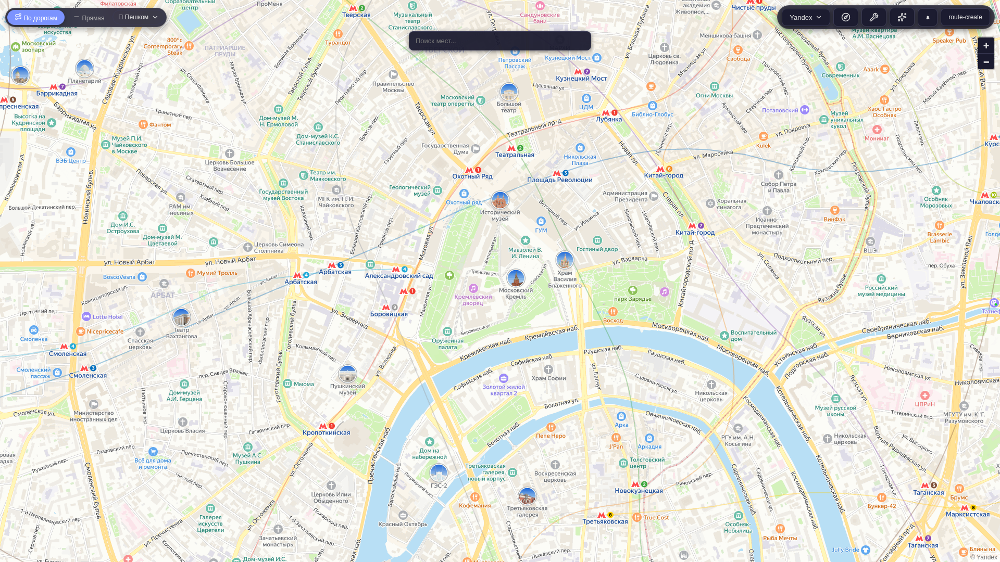

### 2. Три точки и auto-route

Маршрут построен по дорогам, справа открыт инспектор маршрута.

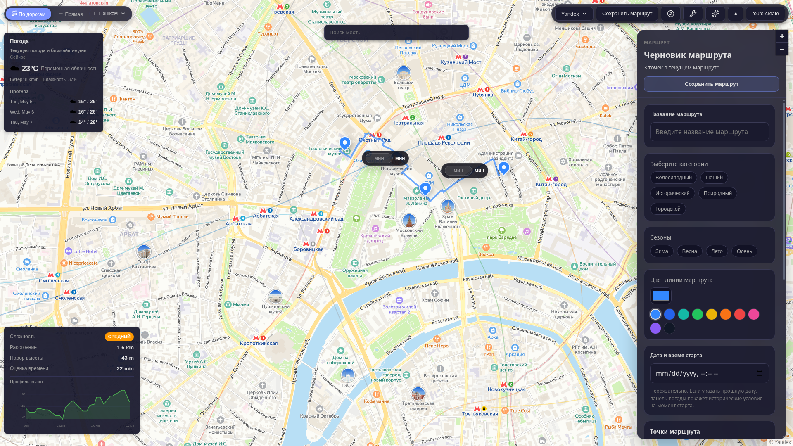

### 3. Категории и сезоны

Выбраны категории/сезоны, дорожная линия не превратилась в прямую.

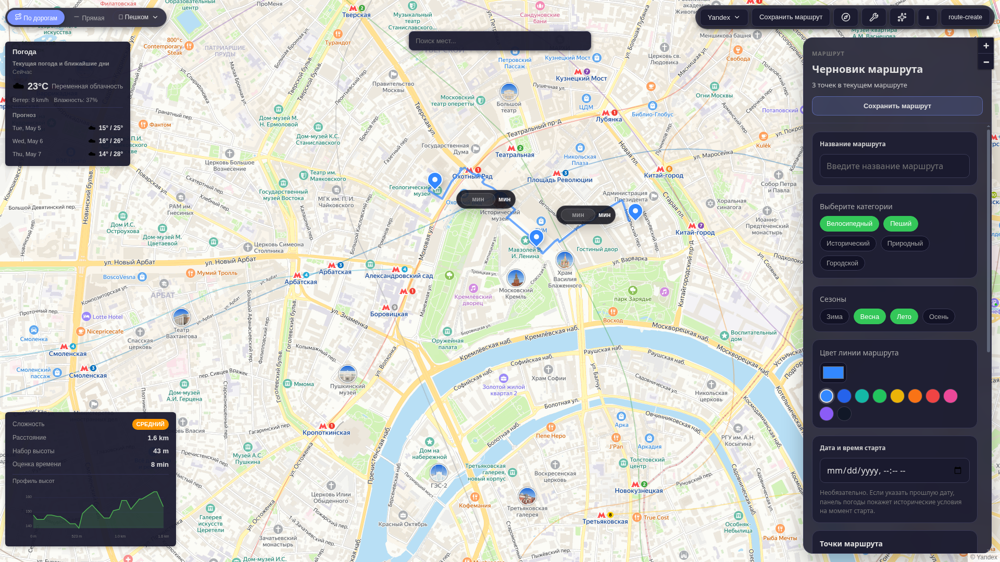

### 4. Цвет линии маршрута

Цвет линии изменился без сброса маршрута.

### 5. Смешанный маршрут

Добавлен четвёртый участок прямой линией, затем режим возвращён на маршрутизацию по дорогам.

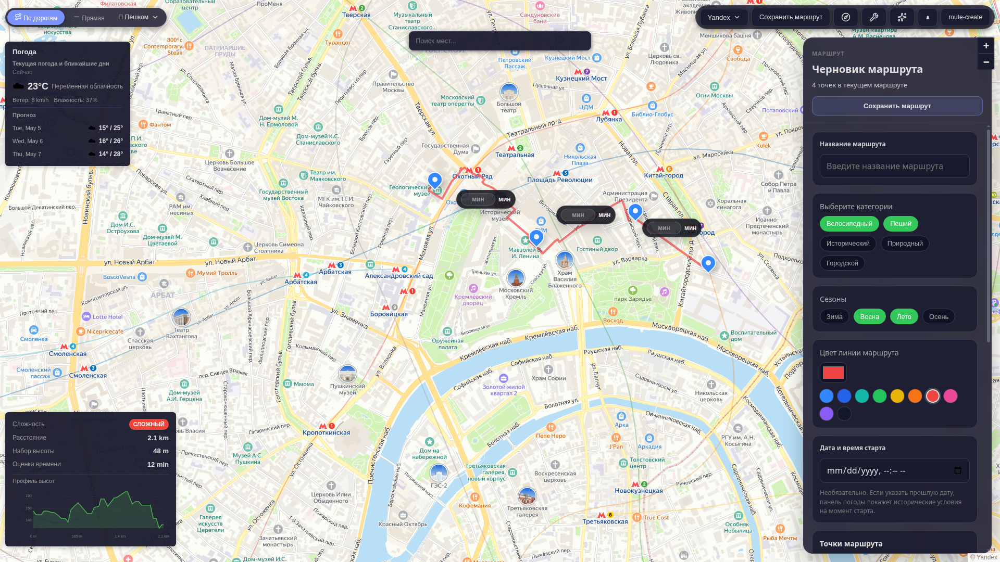

### 6. Метаданные маршрута

Название и дата старта заполнены перед сохранением.

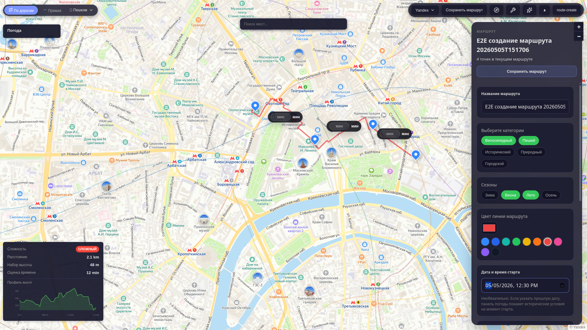

### 7. Настройка точки

В точке заполнена заметка, изменены цвет и размер метки.

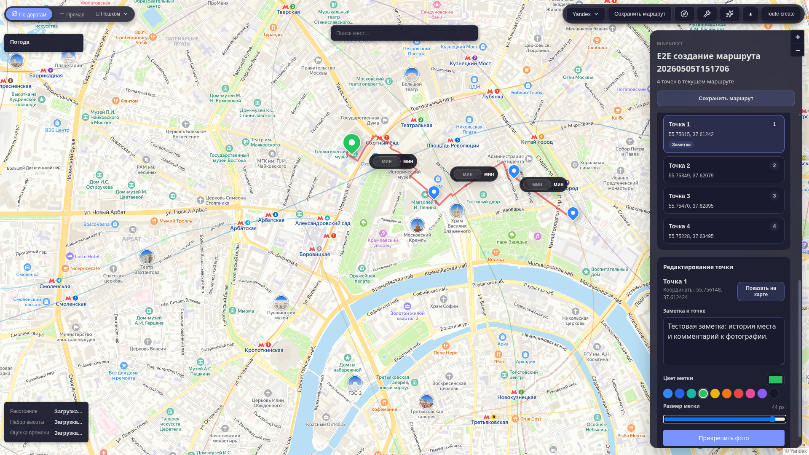

### 8. Фото точки

Фото прикреплено, preview переключён на круг и увеличен.

### 9. Длительность участка

В bubble рядом с участком задано ручное время прохождения.

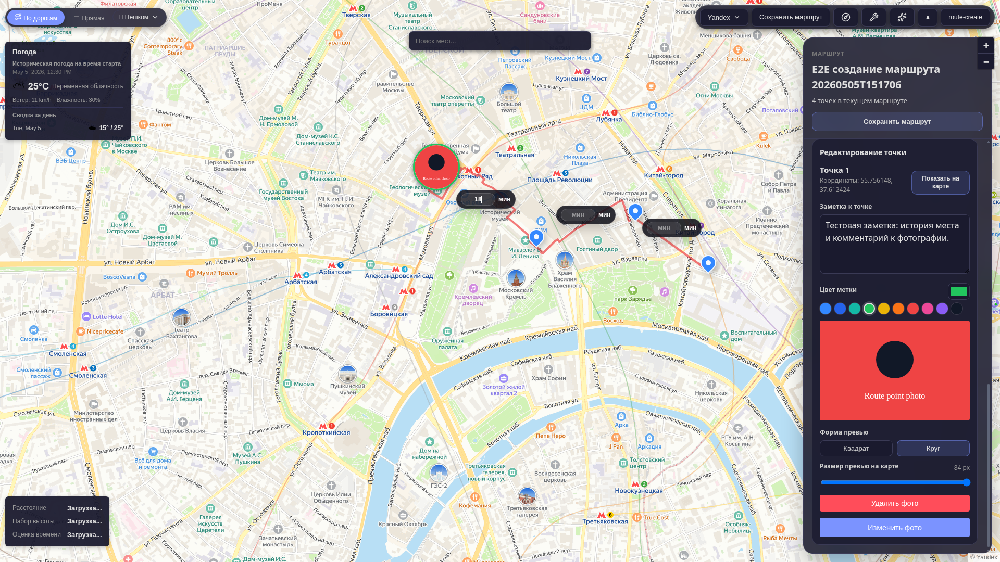

### 10. Инструменты до сохранения

Меню инструментов открыто: импорт фото, воспроизведение, исторический режим, очистка.

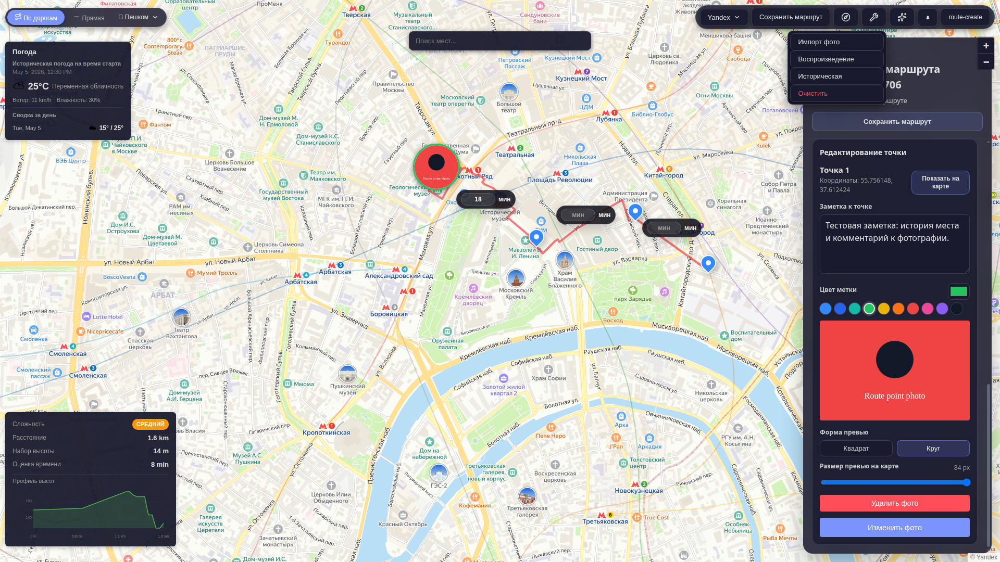

### 11. Safe chaos-клики

После 50 случайных безопасных действий маршрут, точки, линия и inspector остались рабочими.

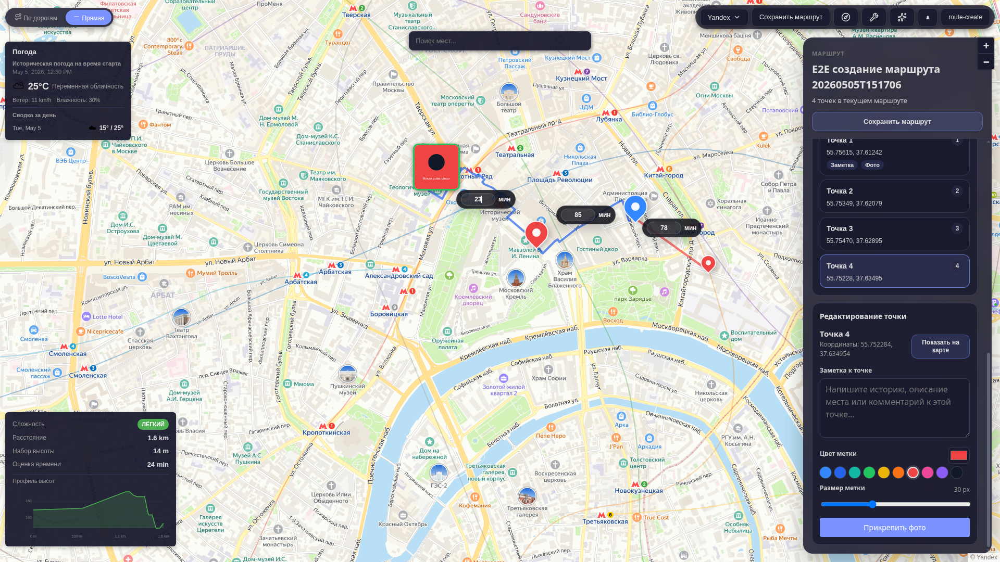

### 12. Сохранённый маршрут

Маршрут сохранён, inspector показывает статус маршрута.

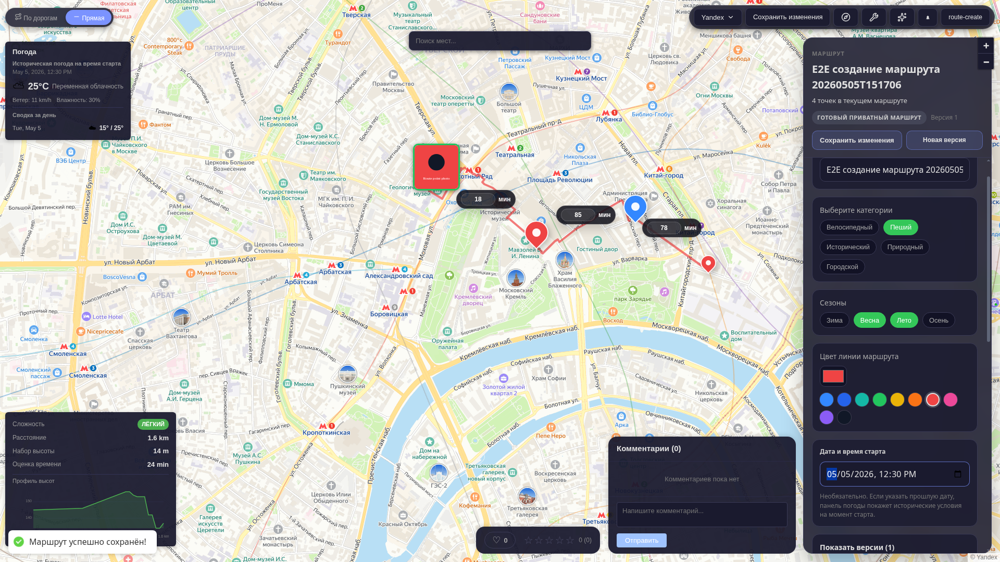

### 13. Инструменты после сохранения

После сохранения доступны экспорт, AI-кнопка, воспроизведение и исторический режим.

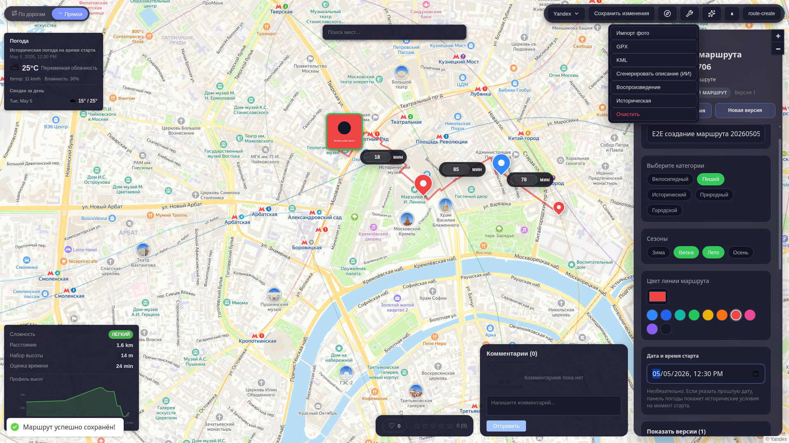

### 14. Воспроизведение маршрута

Playback overlay открылся без перекрытия критичных панелей.

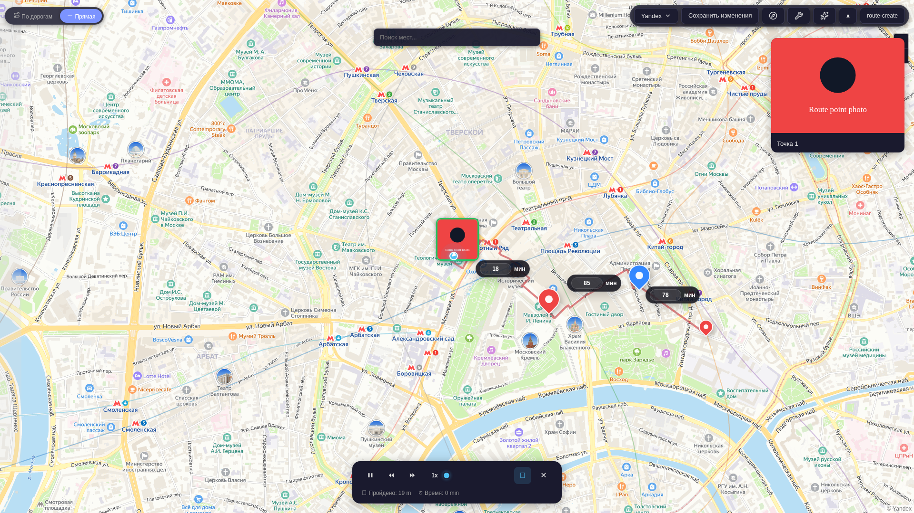

### 15. Исторический режим

Исторический timeline открылся поверх маршрута.

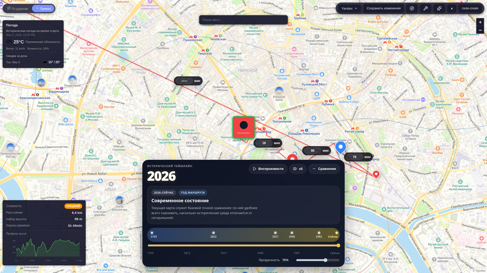

### 16. AI-панель

Панель ассистента открывается отдельным режимом и не вызывает runtime error.

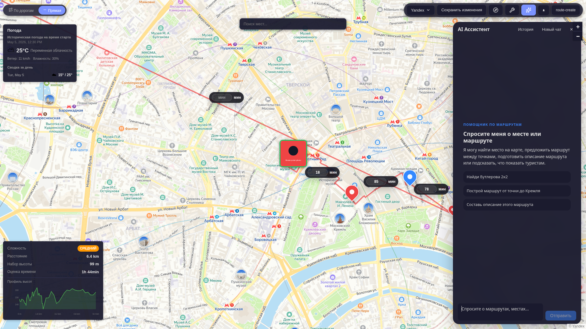

### 17. Подтверждение очистки

Кнопка очистки открывает подтверждение, чтобы случайно не потерять маршрут.

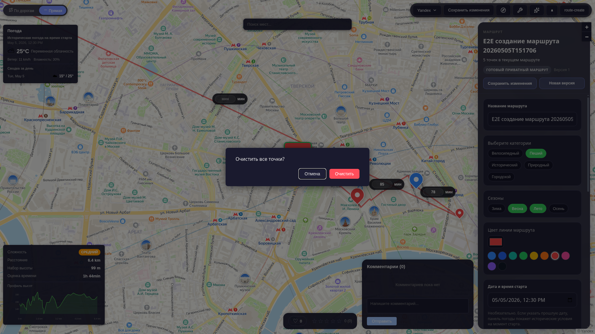
