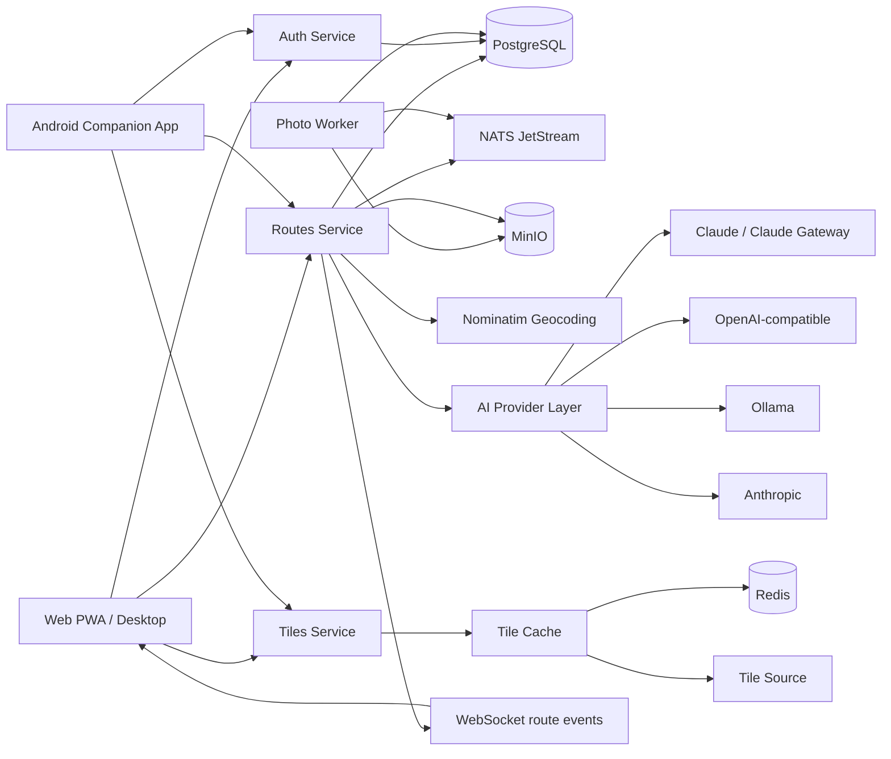

# Паспорт Системы Guide Helper

Дата: 21 апреля 2026  
Проект: Guide Helper  
Назначение документа: быстро ввести автора ВКР в текущее состояние системы и зафиксировать, что именно реально реализовано, как это устроено и что нужно уметь объяснять на защите.

## 1. Коротко о системе

Guide Helper это информационная система для создания, публикации и просмотра туристических маршрутов с геопривязанными фотографиями, заметками к точкам, социальными функциями и интеллектуальным ассистентом.

Система состоит из:
- web/PWA-клиента;
- desktop-клиента на базе Tauri;
- backend-набора микросервисов;
- инфраструктуры деплоя в Kubernetes;
- Android companion app для записи маршрутов в полевых условиях.

## 2. Что считать основным результатом ВКР

### Защищаемый baseline

Основной результат работы:
- web-клиент;
- backend-микросервисы;
- инфраструктура Docker Compose + Kubernetes + ArgoCD;
- AI-контур;
- обработка фотографий;
- маршруты, публикация, просмотр, комментарии, лайки, рейтинги, закладки, поиск, история, уведомления.

### Дополнительный контур

Android-клиент нужно позиционировать как дополнительный полевой инструмент:
- запись GPS-маршрута;
- фото и текстовые заметки к точкам;
- локальный черновик;
- отложенная синхронизация;
- просмотр своих маршрутов.

Не надо продавать Android как полный паритет web-клиента.

## 3. Главная идея проекта в одной фразе

Guide Helper решает задачу создания и публикации туристических маршрутов в одной системе: от построения и аннотирования маршрута до его публикации, обсуждения и повторного использования.

## 4. Практическая ценность

Практическая ценность системы:
- позволяет гидам и авторам маршрутов собирать маршрут, точки, фотографии и текстовые пояснения в едином интерфейсе;
- сокращает ручную сборку материалов из разрозненных сервисов;
- даёт публичный и приватный сценарии распространения маршрутов;
- поддерживает полевой сбор данных через Android-приложение;
- разворачивается в контейнерной инфраструктуре и пригодна для демонстрационного и опытного использования.

## 5. Репозиторий и состав проекта

| Каталог | Назначение |
| --- | --- |
| `backend/auth` | сервис аутентификации и ролей |
| `backend/routes` | основной сервис маршрутов, комментариев, лайков, рейтингов, закладок, AI, уведомлений |
| `backend/photo-worker` | асинхронная обработка фотографий |
| `backend/cache` | сервис кеширования тайлов |
| `backend/tiles` | прокси тайлов карт |
| `frontend` | React/Vite PWA и desktop-клиент через Tauri |
| `mobile` | Android companion app на React Native/Expo |
| `k8s` | Kustomize, ArgoCD, production overlay |
| `claude-code-api` | OpenAI-compatible gateway к Claude Code |
| `doc/latex` | текст ВКР |
| `doc/presentation` | презентация к защите |
| `doc/demo` | материалы демонстрации |

## 6. Архитектурная схема

## 7. Сервисы и их ответственность

| Сервис | Технологии | Ответственность |
| --- | --- | --- |
| Auth | Rust, Axum, SQLx, PostgreSQL, JWT | регистрация, логин, refresh, роли пользователей |
| Routes | Rust, Axum, SQLx, PostgreSQL | маршруты, версии, публикация, комментарии, лайки, рейтинги, закладки, AI, уведомления |
| Photo Worker | Rust, NATS, MinIO | фоновая обработка фото, ресайз, смена статуса обработки |
| Cache | Go | кеширование тайлов, разные storage backend |
| Tiles | Go | прокси картографических тайлов |
| Frontend | React, Vite, PWA, Tauri | основной пользовательский интерфейс системы |
| Mobile | React Native, Expo, Android | запись маршрута и полевой сбор данных |
| Claude Gateway | Python/FastAPI | OpenAI-compatible доступ к Claude Code |

## 8. Роли в системе

### Системные роли

| Роль | Что может |
| --- | --- |
| `user` | создавать и редактировать свои маршруты, публиковать, комментировать, ставить лайки и оценки, сохранять в закладки |
| `moderator` | выполнять привилегированные действия по управлению маршрутами, в том числе удаление |
| `admin` | доступ к админ-панели, статистике, управлению категориями, настройками и ролями пользователей |

### Роли для сценариев ВКР

| Роль в тексте ВКР | Как отображается в системе |
| --- | --- |
| гид / инструктор | обычный `user`, который создаёт и публикует маршруты |
| турист | обычный `user`, который просматривает, сохраняет, комментирует и оценивает маршруты |
| администратор | `admin` |

## 9. Основные пользовательские сценарии

| Сценарий | Краткое описание |
| --- | --- |
| Создание маршрута | пользователь ставит точки, настраивает маршрут, добавляет фото и заметки |
| Геопоиск | пользователь вводит запрос, система находит место через геокодинг |
| Построение маршрута | система строит маршрут между точками и считает параметры |
| Публикация | маршрут сохраняется и может быть опубликован или оставлен приватным |
| Публичный просмотр | маршрут открывается по общему сценарию или по share token |
| Социальное взаимодействие | комментарии, лайки, рейтинги, закладки |
| AI-ассистент | чат и генерация описаний маршрутов с использованием AI |
| Исторический просмотр | overlay исторических карт и таймлайн |
| Полевой сбор данных | Android-приложение записывает трек, фото и заметки, потом синхронизирует |
| Администрирование | статистика, управление категориями, настройками и контентом |

## 10. Доменные сущности

| Сущность | Что хранит |
| --- | --- |
| `User` | идентификатор, email, имя, хеш пароля, аватар, роль |
| `Route` | автор, имя, точки, цвета линии, категории, сезоны, описание, draft/public состояние, версия |
| `RoutePoint` | координаты, имя, заметка, цвет маркера, размер маркера, фото, настройки сегмента |
| `PhotoData` | оригинал, thumbnail, статус обработки |
| `Comment` | текст комментария, автор, маршрут |
| `Like` | отметка нравится для маршрута |
| `Rating` | числовая оценка маршрута |
| `Bookmark` | сохранение маршрута пользователем |
| `Category` | тип маршрута, используемый в фильтрации и публикации |
| `Notification` | события для пользователя |
| `ChatMessage` | сообщения AI-ассистента и пользователя |

## 11. Что хранится в маршруте

Ключевые поля маршрута:
- название;
- массив точек маршрута;
- время начала `started_at`;
- список категорий;
- список сезонов;
- цвет линии маршрута;
- текстовое описание;
- `is_draft`;
- `source_route_id`;
- `version_group_id`;
- `version_number`;
- `share_token`.

Ключевые поля точки маршрута:
- `lat`, `lng`;
- `name`;
- `note`;
- `marker_color`;
- `marker_size`;
- `preview_size`;
- `preview_shape`;
- `segment_mode`;
- `segment_duration_minutes`;
- `photo`.

## 12. Основные web-страницы

| Маршрут | Страница | Назначение |
| --- | --- | --- |
| `/login` | Auth | вход и регистрация |
| `/map` | MapPage | главный редактор маршрута |
| `/profile` | ProfilePage | профиль пользователя и его маршруты |
| `/admin` | AdminPage | административный интерфейс |
| `/explore` | ExplorePage | публичный каталог маршрутов |
| `/bookmarks` | BookmarksPage | сохранённые маршруты |
| `/shared/:token` | SharedMapPage | просмотр общего маршрута по ссылке |
| `/embed/:token` | EmbedMapPage | встраиваемое представление маршрута |

## 13. Ключевые frontend-компоненты

| Компонент | Назначение |
| --- | --- |
| `ChatPanel` | AI-ассистент |
| `GeoSearchControl` | поиск мест |
| `HistoricalMapOverlay` | историческая карта и таймлайн |
| `WeatherPanel` | погода |
| `ElevationChart` | профиль высоты |
| `RouteStatsPanel` | статистика маршрута |
| `RoutePlayback` | воспроизведение маршрута |
| `CommentSection` | комментарии |
| `LikeRatingBar` | лайки и оценки |
| `NotificationBell` | уведомления |
| `QRCodeModal` | QR-код для публикации |

## 14. Mobile scope

### Что входит в Android companion app

| Функция | Статус |
| --- | --- |
| запись GPS-маршрута | входит |
| пауза / продолжение / завершение | входит |
| фото к точкам | входит |
| текстовые заметки к точкам | входит |
| локальный черновик | входит |
| очередь синхронизации | входит |
| просмотр своих маршрутов | входит |
| удаление маршрута | входит |

### Что не входит в mobile baseline

| Функция | Причина |
| --- | --- |
| админка | не нужна для полевого сценария |
| публичный каталог | основной канал для этого web |
| AI-чат | основной сценарий реализован на web |
| сложный versioning workflow | слишком тяжёлый scope для mobile baseline |
| исторический таймлайн | не ключевой полевой сценарий |
| полный паритет с web | это уже второй полноценный клиент |

## 15. Публичные и защищённые API

### Публичные

| Endpoint group | Назначение |
| --- | --- |
| `/healthz`, `/metrics` | health и метрики |
| `/api/v1/routes/explore` | публичный каталог |
| `/api/v1/shared/{token}` | общий маршрут |
| `/api/v1/routes/{id}/comments` | публичное чтение комментариев |
| `/api/v1/routes/{id}/like` | публичное чтение счётчика |
| `/api/v1/routes/{id}/rating` | публичное чтение рейтинга |
| `/api/v1/settings/difficulty` | справочник сложности |
| `/api/v1/categories` | категории |
| `/api/v1/chat/health` | статус AI-контура |

### Требуют JWT

| Endpoint group | Назначение |
| --- | --- |
| `/api/v1/routes` | CRUD маршрутов |
| `/api/v1/routes/import` | импорт GeoJSON |
| `/api/v1/routes/{id}/versions` | история версий |
| `/api/v1/routes/{id}/share` | публикация/снятие публикации |
| `/api/v1/bookmarks` | список закладок |
| `/api/v1/admin/*` | административные функции |
| `/api/v1/notifications/*` | уведомления |
| `/api/v1/chat/*` | AI-чат |

## 16. Интеграции и внешние зависимости

| Интеграция | Для чего нужна |
| --- | --- |
| PostgreSQL | основное хранилище |
| Redis | быстрый кеш |
| NATS JetStream | событийная шина для фото и уведомлений |
| MinIO | объектное хранилище фотографий |
| Nominatim | геокодинг |
| AI provider layer | AI-ассистент и генерация описаний |
| Kubernetes + ArgoCD | production-деплой |
| GitHub Actions | CI/CD |

## 17. Что реально сделано и что можно говорить уверенно

### Реально можно защищать

- система не макет, а рабочий проект с несколькими клиентами и микросервисами;
- есть отдельный сервис аутентификации;
- есть основной сервис маршрутов;
- есть асинхронная обработка фотографий через NATS и MinIO;
- есть PWA/web-клиент и desktop-оболочка;
- есть Android companion app;
- есть деплой через Docker Compose и Kubernetes;
- есть AI-контур с переключаемыми провайдерами;
- есть базовая социальная составляющая: комментарии, лайки, рейтинги, закладки;
- есть механизм публикации по токену;
- есть история версий маршрутов;
- есть автоматизированные unit-тесты и описание сценариев тестирования в ВКР.

### Что не надо обещать лишнего

- не говорить, что mobile полностью равен web;
- не говорить, что система уже массово внедрена;
- не говорить, что AI полностью автономно понимает любой пользовательский контекст без ограничений;
- не делать ставку на любую нестабильную live-функцию, если нет fallback.

## 18. Сильные стороны проекта

| Сильная сторона | Почему это хорошо для защиты |
| --- | --- |
| Много контуров системы | видно, что работа большая и инженерно насыщенная |
| Микросервисная архитектура | можно показать осмысленное разделение ответственности |
| Асинхронная обработка фото | сильный технический аргумент, что это не CRUD на 3 формы |
| AI-контур | добавляет современность и прикладную ценность |
| Kubernetes и ArgoCD | показывает инфраструктурную зрелость |
| Android companion app | усиливает практическую ценность и полевой сценарий |
| Социальные функции | маршрут не только создаётся, но и используется другими |

## 19. Основные риски

| Риск | Что делать |
| --- | --- |
| Автор плохо знает свой же текст | изучить этот паспорт, потом введение, главу 3 и заключение |
| Слишком широкий scope на защите | жёстко держать baseline и не уходить в побочные контуры |
| Нестабильный live demo | иметь видео, скриншоты и заранее подготовленные данные |
| Комиссия спросит “зачем микросервисы” | держать готовый ответ |
| Комиссия спросит “зачем AI” | держать готовый ответ |
| Комиссия спросит “почему mobile не полный” | отвечать, что это companion app для полевого сценария |

## 20. Что нужно запомнить в первую очередь

### 1. Главный результат

Разработана и развёрнута информационная система для создания, публикации и просмотра туристических маршрутов с геопривязанными фотографиями, социальными функциями и интеллектуальным ассистентом.

### 2. Почему не монолит

Потому что в системе есть разные по профилю нагрузки и ответственности контуры:
- аутентификация;
- маршруты и социальные функции;
- асинхронная обработка фото;
- кеширование и выдача тайлов;
- AI-интеграции.

Такое разделение упрощает развитие, масштабирование и изоляцию ошибок.

### 3. Зачем AI

AI нужен не ради моды, а для интеллектуального интерфейса:
- помощь в общении с пользователем;
- генерация текстовых описаний маршрута;
- обработка запросов в более естественной форме, чем жёсткие кнопки и фильтры.

### 4. Почему web основной, а mobile дополнительный

Потому что основное проектирование, редактирование, публикация и администрирование удобнее выполнять на большом экране, а mobile лучше подходит для полевого сбора маршрута, фото и заметок.

## 21. 60-секундное объяснение проекта

Я разработал систему Guide Helper для создания и публикации туристических маршрутов. Пользователь может построить маршрут на карте, добавить к точкам фотографии и заметки, опубликовать маршрут, а другие пользователи могут его просматривать, комментировать, оценивать и сохранять. Архитектурно это набор микросервисов на Rust и Go с web-клиентом на React, асинхронной обработкой фотографий через очередь сообщений и деплоем в Kubernetes. Дополнительно реализован Android-клиент для полевой записи маршрутов и их последующей синхронизации.

## 22. 3-минутное объяснение проекта

Guide Helper это информационная система для маршрутов, ориентированная на практическую задачу: автор маршрута должен не просто нарисовать линию на карте, а собрать целостный материал о маршруте, включая точки интереса, фотографии, текстовые пояснения и сценарий публикации.

Для этого я реализовал web-клиент, в котором можно создавать маршруты, редактировать точки, публиковать их и работать с социальными функциями. Система поддерживает комментарии, лайки, рейтинги и закладки, поэтому маршрут может не только создаваться, но и использоваться другими пользователями. Для поиска мест используется геокодинг, а для интеллектуального взаимодействия и генерации описаний подключён AI-контур с несколькими провайдерами.

С архитектурной точки зрения система построена как набор микросервисов. Отдельно вынесены аутентификация, основной сервис маршрутов, обработка фотографий, кеширование и выдача тайлов. Обработка фотографий сделана асинхронной через NATS JetStream и MinIO, чтобы не блокировать пользовательские сценарии. Для развёртывания используются Docker Compose, Kubernetes и ArgoCD.

Дополнительно я реализовал Android companion app. Он не дублирует весь web-функционал, а закрывает полевой сценарий: запись маршрута по GPS, добавление фотографий и заметок к точкам, локальное сохранение и последующую синхронизацию. Это усиливает практическую ценность системы, потому что маршрут можно не только спроектировать за компьютером, но и реально собирать в процессе прохождения.

## 23. Что учить дальше после этого документа

Порядок изучения:
1. этот паспорт;
2. введение ВКР;
3. заключение;
4. глава 3 ВКР;
5. презентация;
6. demo-flow.

## 24. Что ещё желательно подготовить

- отдельную схему базы данных;
- отдельную схему CI/CD;
- список “20 вопросов комиссии и ответы”;
- фиксированный demo script;
- один файл “что не входит в scope”.
